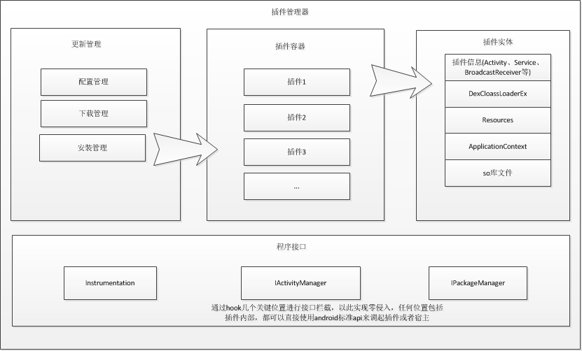

   
# 简介
 
　Lipland是一个基于Android系统的轻量级插件框架(Lightweight plug-in framework for android)，一个apk可以免修改、免安装，直接运行在插件系统内，插件可动态网络下载更新。Lipland开发宗旨是：轻便灵活、简单易用、功能稳定、兼容性好。

　Lipland在360搜索app中全面应用两年多，几乎每一个独立的入口都是一个插件，插件的开发团队各不相同，各个插件又在各大不同的产品线中得到复用，有的插件本身也是一个独立发布的产品。这种插件化技术，为产品的解耦合和复用带来了极高的效益，功能升级对用户零打扰。
　
# 关于名称
 
　Lipland由 **li - 轻量级**、**pl - 插件**、**and - 安卓** 英文缩写组合而来。
有些同学说不会读，来，看我口型：李 ~ 普 ~ 兰 ~ 德。对没错，就是这样。。

# 整体架构



# 特性

 * 轻便易用，体积小，仅支持android 4.0.0或以上版本，不背历史包袱。
 * 插件为一个独立apk，免修改，免安装，动态更新升级。
 * 支持android四大组件：Activity、Service、ContentProvider、BroadcastReceiver
 * 支持插件so加载、Action/Action-Filter、AIDL等。
 * 支持android所有的资源定义，不需要任何特殊处理。
 * 支持插件与宿主共享jar包、共享so库的机制，可以很好的为插件瘦身。
 * 单进程，用一个独立的插件进程统一管理插件和内存，复杂度低。
 * 插件更新系统，通过一个简单的配置文件即可实现插件更新。
 
# 适用场景

- 功能模块相对独立，想要单独拆分的应用。
- 应用体积过大，想要瘦身/减流。
- 想要将功能动态化，后台升级，提升用户体验的应用。
- 复用现有产品功能，减少代码堆砌，降低应用耦合度。
- 不同团队间的合作开发。


# jar、so共享机制

　Lipland允许你的插件直接使用宿主的类和so库，想要共享的库直接放在宿主中即可。

　Lipland的类、库加载顺序如下：

 - **jar包**：插件先从自身的ClassLoader加载类，如果找不到类，则从宿主的ClassLoader中加载。

 - **so库**：同名so库，先从自身libs下加载，如果找不到库，则从宿主的libs加载。
  

　该机制可以很大程度的缩减插件体积，一些公用库，例如volley、android-support-v4.ja、v7兼容包、第三方sdk等，插件直接用provided方式引用，这样这些库不会编译到插件中。如果是so库，可以不包含在插件中。

　在某些情况下，插件想要使用一个不同版本的类、jar包或者so库，那么这个插件只需要把该库以正常的编译方式打包进去即可(jar包使用compile方式编译，so放入libs下)。

# 如何使用

1. 在你的应用的Application.onCreate()中加入以下代码，即可完成插件框架的安装。

```java
PluginManager.setup(app);
```
        
2. 安装插件

```java
PluginManager.getInstance().install("myplugin","1.0.0","/sdcard/myplugin.apk");
```

3. 启动插件

* className方式
   
```java
Intent intent = new Intent();
intent.setClassName("com.testplugin","com.testplugin.MainActivity");
context.startActivity(intent);
```
* Action方式
   
```java
Intent intent = new Intent();
intent.setAction("action.testplugin.main");
context.startActivity(intent);
```
捆包安装、动态升级、插件管理等更多详细配置和使用方法参见文档和demo。


# 包引入

* Gradle

   将编译后的aar包放在主程序的libs下，在gradle中加入以下内容：
   
   ```groovy
   dependencies {
       compile(name: 'Lipland_v2.0.6', ext: 'aar') 
   }
   repositories {
        flatDir{
            dirs 'libs';
         }
   }
   ```

* eclipse

　　1. 将编译好的jar包放入主程序的libs下。

　　2. 将AndroidManifest.xml中的配置拷贝到主工程中。

　　　gradle也可以使用jar包，配置方式和eclipse一样，建议使用gradle和.aar，部分配置可以自动生成，比较方便。


插件更新
=======

[插件更新](files/md/update.md)

添加插件
=======

　增加一个插件有三种方式：
- **捆包插件**  

    即将插件自带在app中，适合优先级高的插件。在assets/plugin/default_install.xml添加一个插件信息节点，并将插件放入同目录下即可，app第一次启动后，会进行安装。具体配置参加demo。


- **插件更新**

    插件更新系统在插件未安装的情况下，会将插件直接安装，利用它可以动态的增加插件。

- **直接安装**

    调用Api直接安装，该方法适合灵活性要求比较高，需要自己管理插件的场景,详情见前述安装插件或者文档。


谁在使用
=======

　360搜索

　360语音助手

　360身边生活

　360免费wifi

　360导航

　360盖娅
 
 

插件化案例
=======

　360语音助手(功能与独立版一致)
 
　360身边生活(功能与独立版一致)

　360导航

　360小说

　360天气

　360影视

　360视频播放器

　滴滴打车(SDK)

　360看图插件

　360美图

　360扫码

　拍题插件

　饭补插件

　玩图插件

　等等


交流群
=======

QQ群：589438370


<html>
<a target="_blank" href="//shang.qq.com/wpa/qunwpa?idkey=07c851a366035eb067871fcd3113a8211b27b86bfabf72513bc9f4de242aac84"></a>
</html>


FAQ
=======
